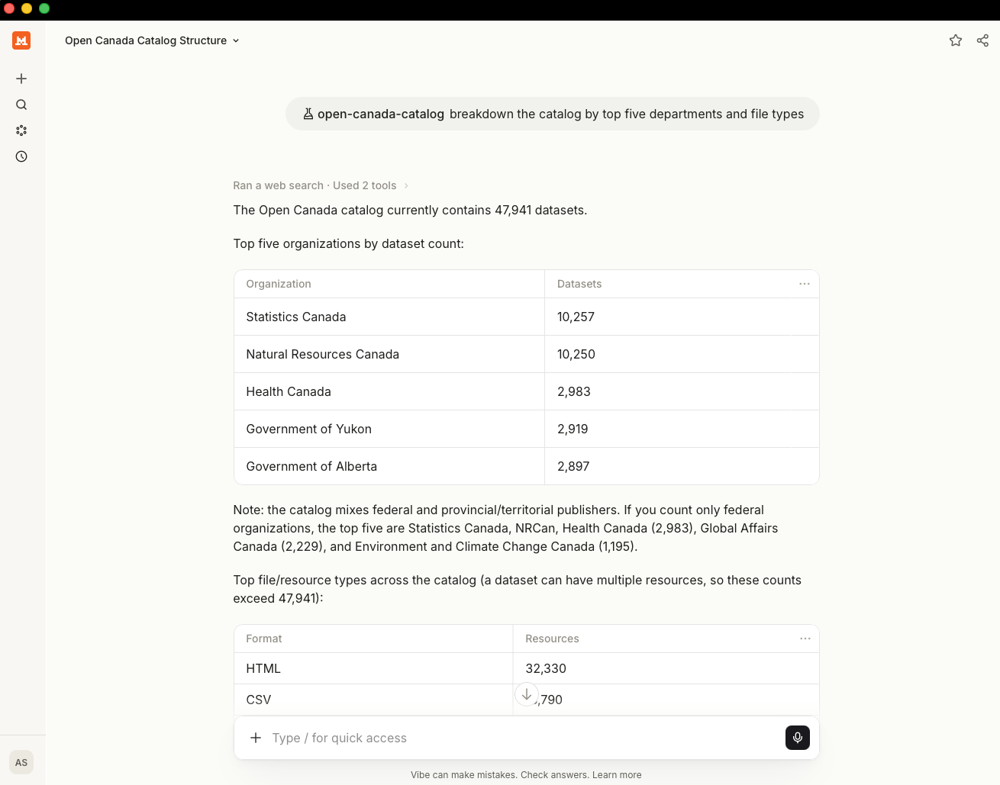
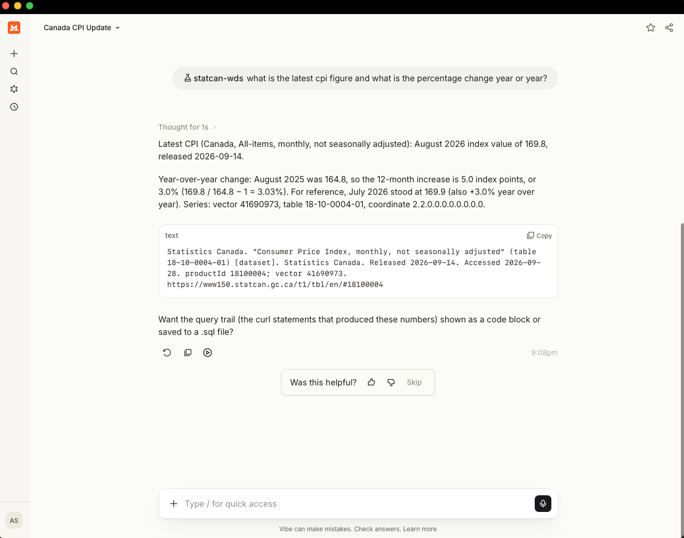

# Public Service AI Challenge: Team 8 Skill/Tool Development

> **Work in progress.** Patterns are verified against the live APIs, but
> contents and structure may change.

| Open Canada Catalog | StatCan WDS |
|:---:|:---:|
|  |  |

*Example prompts and responses from the Vibe Work desktop browser client.*

Example written brief: *"What has been the biggest Labour Force change in
Canada?"* — [Canada's biggest labour force change, COVID era 2020–2026
(PDF)](assets/canada-s-biggest-labour-force-change-covid-era-2020-2026.pdf)

This repo currently contains two agent skills: one for navigating Open
Canada catalog metadata, and one for navigating StatCan cube metadata.
Both browse live over https — no downloads, no ingestion pipeline, no
API keys — and when a resource is in a DuckDB-readable format (CSV, JSON,
Parquet), the skills can also do analytics over-the-wire, querying it in
place. Resources that cannot be queried in place (ZIP, XLSX, PDF, SHP)
are stated as such rather than approximated.

- `open-canada-catalog` — the Open Canada (CKAN) catalog: search ~48,000
  datasets across 350+ departments, then query chosen CSV/JSON resources
  in place.
- `statcan-wds` — pulls official Statistics Canada data straight from the
  source: inflation, jobs, population. Finds the table, reads its
  dimensions, then serves the exact series you need — lightweight
  analytics over the wire, usually with no download at all. Full-table
  CSV export only when you ask.

## Quickstart — Claude Code

Prerequisites: git, [uv](https://docs.astral.sh/uv/), and the DuckDB CLI
(it carries the httpfs extension needed for in-place queries).

    brew install uv duckdb
    git clone https://github.com/asloci/psai.git && cd psai
    uv run psai build-claude
    claude --plugin-dir dist/claude/gc-data-explorer

Then invoke the skills with `/open-canada-catalog` and `/statcan-wds`.

- Claude Code loads the plugin per-session via `--plugin-dir`; see the
  `marketplace.json` in `dist/` to install it persistently.
- Claude Work (the web client) cannot mount a local plugin directory —
  use Claude Code on your machine.
- `curl` ships with macOS. `jq` (used in some example commands) does not;
  `brew install jq` is optional.

## Quickstart — Agent-skills users (Vibe, and any agent that discovers `.agents/skills/`)

Prerequisites: git and the DuckDB CLI. No build step and no uv required.

    brew install duckdb
    git clone https://github.com/asloci/psai.git && cd psai

- Project-scoped (Vibe): open the cloned repo and accept the trust
  prompt. The committed `.agents/skills/` directory is discovered
  automatically — `/open-canada-catalog` and `/statcan-wds` work
  immediately.
- Global (any agent reading `~/.agents/skills/`): copy the skills once:

      cp -R plugin/skills/statcan-wds plugin/skills/open-canada-catalog ~/.agents/skills/

  They are then available in every project. Run `/reload` (Vibe) if a
  session is already running.

## Note on reasoning modes

These are prompt-based skills: instructions your agent reads and may
choose to follow — or ignore. Consider this repo a proof-of-concept. Both
skills work by orchestrating multi-step API calls (search →
metadata → coordinate/vector → data), not by reading web pages. They
work best in a coding agent running with thinking or high-reasoning
enabled. In low-reasoning or "fast" modes, agents tend to skip the skill
and scrape stats off websites instead — if you see that, raise the
reasoning level and re-ask.

- Vibe: `/thinking high` before your question (or set
  `thinking = "high"` on the model entry in `~/.vibe/config.toml`).
- Claude Code/Claude Work: enable extended thinking.

## Roadmap

- Add more per-department skills for portals with APIs (provincial CKAN
  portals, other departments).
- Create an all-encompassing front-desk skill that routes to the
  per-department skills.
- That front-desk skill will offer a catalog of what is actually
  available for over-the-wire analytics — so users never ask for PDFs,
  HTML, SHP, XLSX, or ZIP files, and get straight to what is queryable.
